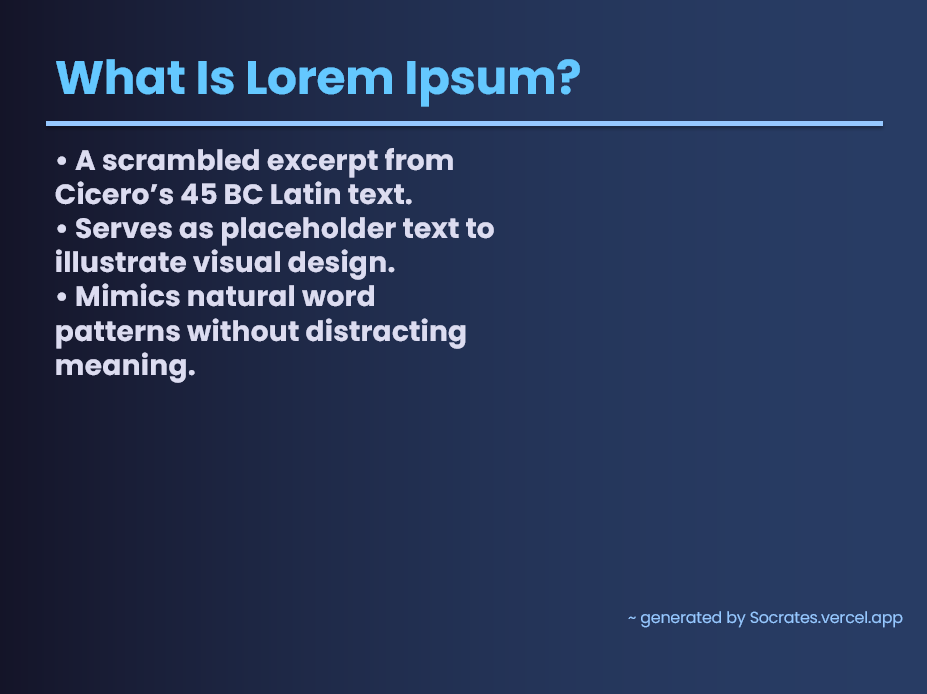

# Socrates - AI Slides Generator
##### `powered by openai/gpt-oss-120b`

A Python tool that converts user prompts into PowerPoint slides.

## Features
- Prompt to create powerpoint presentations
- Basic text formatting for presentations
- Latest data used by the ai-model

## Sample Slide

## Usage
Run `python demo.py`, enter topic and slide count, and the `.pptx` file is generated.

Built using `python-pptx`

Last Updated: 11th May 2026

